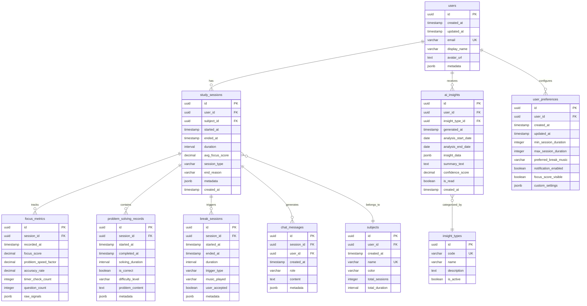

# 🗄️ 적응형 스터디 타이머 - ERD (Entity-Relationship Diagram) 문서

## 문서 정보
- **버전**: v1.0
- **최종 수정일**: 2026-01-29
- **작성자**: Database Architecture Team
- **데이터베이스**: PostgreSQL 15 (Supabase)
- **정규화 수준**: 3NF with selective denormalization

---

## 목차
1. [ERD 다이어그램](#1-erd-다이어그램)
2. [엔티티 정의](#2-엔티티-정의)
3. [속성 명세](#3-속성-명세)
4. [관계 매핑](#4-관계-매핑)
5. [Primary/Foreign Key 구조](#5-primaryforeign-key-구조)
6. [인덱스 전략](#6-인덱스-전략)
7. [제약조건 및 비즈니스 규칙](#7-제약조건-및-비즈니스-규칙)
8. [데이터 타입 및 유효성 검증 규칙](#8-데이터-타입-및-유효성-검증-규칙)
9. [정규화 분석](#9-정규화-분석)
10. [성능 최적화 고려사항](#10-성능-최적화-고려사항)
11. [마이그레이션 및 버전 관리 전략](#11-마이그레이션-및-버전-관리-전략)

---

## 1. ERD 다이어그램

### 1.1 전체 ERD (Mermaid)



### 1.2 핵심 관계 요약

```
User (1) ──────< (N) StudySession
                      │
                      ├──< (N) FocusMetrics
                      ├──< (N) ProblemSolvingRecords
                      ├──< (N) BreakSessions
                      └──< (N) ChatMessages

User (1) ──────< (N) AIInsights
User (1) ────── (1) UserPreferences
User (1) ──────< (N) Subjects

StudySession (N) ──────> (1) Subject
AIInsight (N) ──────> (1) InsightType
```

---

## 2. 엔티티 정의

### 2.1 핵심 엔티티 (Core Entities)

| 엔티티명 | 설명 | 비즈니스 목적 | 예상 레코드 수 |
|---------|------|--------------|---------------|
| `users` | 시스템 사용자 | 인증 및 데이터 소유권 | 1 (단일 사용자, 향후 확장) |
| `study_sessions` | 공부 세션 기록 | 학습 활동의 기본 단위 | ~3,650/년 (일 10회 × 365일) |
| `focus_metrics` | 집중도 메트릭 | 실시간 집중도 추적 | ~36,500/년 (세션당 10회) |
| `problem_solving_records` | 문제 풀이 기록 | 학습 성과 측정 | ~7,300/년 (세션당 2회) |
| `break_sessions` | 휴식 세션 | 휴식 패턴 분석 | ~1,825/년 (일 5회) |
| `ai_insights` | AI 생성 인사이트 | 학습 패턴 분석 결과 | ~365/년 (일일) + ~52/년 (주간) |
| `chat_messages` | 챗봇 대화 기록 | AI 코치 상호작용 로그 | ~7,300/년 (세션당 2회) |

### 2.2 참조 엔티티 (Reference Entities)

| 엔티티명 | 설명 | 타입 | 예상 레코드 수 |
|---------|------|------|---------------|
| `subjects` | 학습 주제/과목 | 마스터 데이터 | ~10 (사용자당) |
| `insight_types` | 인사이트 유형 | 코드 테이블 | ~10 (고정) |
| `user_preferences` | 사용자 환경설정 | 설정 데이터 | 1 (사용자당) |

---

## 3. 속성 명세

### 3.1 users (사용자)

| 컬럼명 | 데이터 타입 | NULL | 기본값 | 설명 |
|--------|------------|------|--------|------|
| `id` | `uuid` | NOT NULL | `gen_random_uuid()` | 사용자 고유 ID (PK) |
| `created_at` | `timestamptz` | NOT NULL | `now()` | 생성 시각 |
| `updated_at` | `timestamptz` | NOT NULL | `now()` | 수정 시각 |
| `email` | `varchar(255)` | NOT NULL | - | 이메일 주소 (UK) |
| `display_name` | `varchar(100)` | NULL | - | 표시 이름 |
| `avatar_url` | `text` | NULL | - | 프로필 이미지 URL |
| `metadata` | `jsonb` | NULL | `'{}'::jsonb` | 추가 메타데이터 |

**Note:**
- Supabase Auth의 `auth.users`와 연동되며, `id`는 `auth.uid()`와 동일
- `email`은 Supabase Auth에서 자동 동기화
- `metadata`는 온보딩 정보, 최초 사용 날짜 등 저장

### 3.2 user_preferences (사용자 환경설정)

| 컬럼명 | 데이터 타입 | NULL | 기본값 | 설명 |
|--------|------------|------|--------|------|
| `id` | `uuid` | NOT NULL | `gen_random_uuid()` | 설정 고유 ID (PK) |
| `user_id` | `uuid` | NOT NULL | - | 사용자 ID (FK) |
| `created_at` | `timestamptz` | NOT NULL | `now()` | 생성 시각 |
| `updated_at` | `timestamptz` | NOT NULL | `now()` | 수정 시각 |
| `min_session_duration` | `integer` | NOT NULL | `15` | 최소 세션 시간 (분) |
| `max_session_duration` | `integer` | NOT NULL | `50` | 최대 세션 시간 (분) |
| `preferred_break_music` | `varchar(50)` | NOT NULL | `'lofi'` | 선호 휴식 음악 스타일 |
| `notification_enabled` | `boolean` | NOT NULL | `true` | 알림 수신 여부 |
| `focus_score_visible` | `boolean` | NOT NULL | `true` | 집중도 점수 표시 여부 |
| `custom_settings` | `jsonb` | NULL | `'{}'::jsonb` | 커스텀 설정 (확장성) |

**Note:**
- `user_id`는 `users.id`와 1:1 관계
- `custom_settings`는 향후 추가 설정을 위한 확장 필드

### 3.3 subjects (학습 주제/과목)

| 컬럼명 | 데이터 타입 | NULL | 기본값 | 설명 |
|--------|------------|------|--------|------|
| `id` | `uuid` | NOT NULL | `gen_random_uuid()` | 과목 고유 ID (PK) |
| `user_id` | `uuid` | NOT NULL | - | 사용자 ID (FK) |
| `created_at` | `timestamptz` | NOT NULL | `now()` | 생성 시각 |
| `name` | `varchar(100)` | NOT NULL | - | 과목명 |
| `color` | `varchar(7)` | NULL | `'#2563EB'` | 색상 코드 (HEX) |
| `total_sessions` | `integer` | NOT NULL | `0` | 총 세션 수 (denormalized) |
| `total_duration` | `interval` | NOT NULL | `'0 seconds'` | 총 학습 시간 (denormalized) |

**Note:**
- `(user_id, name)`은 복합 유니크 키
- `total_sessions`, `total_duration`은 성능을 위한 비정규화 필드
- 세션 종료 시 트리거로 자동 업데이트

### 3.4 study_sessions (공부 세션)

| 컬럼명 | 데이터 타입 | NULL | 기본값 | 설명 |
|--------|------------|------|--------|------|
| `id` | `uuid` | NOT NULL | `gen_random_uuid()` | 세션 고유 ID (PK) |
| `user_id` | `uuid` | NOT NULL | - | 사용자 ID (FK) |
| `subject_id` | `uuid` | NULL | - | 과목 ID (FK) |
| `started_at` | `timestamptz` | NOT NULL | `now()` | 세션 시작 시각 |
| `ended_at` | `timestamptz` | NULL | - | 세션 종료 시각 |
| `duration` | `interval` | NULL | - | 총 세션 시간 (계산 필드) |
| `avg_focus_score` | `decimal(3,1)` | NULL | - | 평균 집중도 점수 (1.0-10.0) |
| `session_type` | `varchar(20)` | NOT NULL | `'manual'` | 세션 유형 |
| `end_reason` | `varchar(30)` | NULL | - | 종료 사유 |
| `metadata` | `jsonb` | NULL | `'{}'::jsonb` | 추가 메타데이터 |
| `created_at` | `timestamptz` | NOT NULL | `now()` | 레코드 생성 시각 |

**Enum 값:**
- `session_type`: `'manual'`, `'auto_extended'`, `'auto_paused'`
- `end_reason`: `'user_ended'`, `'auto_break'`, `'fatigue_detected'`, `'time_limit'`

**Note:**
- `duration`은 `ended_at - started_at`으로 자동 계산 (트리거)
- `avg_focus_score`는 세션 종료 시 `focus_metrics` 평균으로 계산
- 진행 중인 세션은 `ended_at IS NULL`

### 3.5 focus_metrics (집중도 메트릭)

| 컬럼명 | 데이터 타입 | NULL | 기본값 | 설명 |
|--------|------------|------|--------|------|
| `id` | `uuid` | NOT NULL | `gen_random_uuid()` | 메트릭 고유 ID (PK) |
| `session_id` | `uuid` | NOT NULL | - | 세션 ID (FK) |
| `recorded_at` | `timestamptz` | NOT NULL | `now()` | 측정 시각 |
| `focus_score` | `decimal(3,1)` | NOT NULL | - | 계산된 집중도 점수 (1.0-10.0) |
| `problem_speed_factor` | `decimal(4,2)` | NULL | - | 문제 풀이 속도 계수 (기준 대비 비율) |
| `accuracy_rate` | `decimal(4,2)` | NULL | - | 정답률 (0.00-1.00) |
| `timer_check_count` | `integer` | NOT NULL | `0` | 타이머 확인 횟수 (최근 5분간) |
| `question_count` | `integer` | NOT NULL | `0` | 질문 개수 (최근 5분간) |
| `raw_signals` | `jsonb` | NULL | `'{}'::jsonb` | 원시 신호 데이터 |

**Note:**
- 클라이언트에서 5분마다 전송
- `focus_score`는 클라이언트 또는 서버에서 계산
- `raw_signals`에는 마우스 움직임, 키보드 활동 등 추가 신호 저장 가능

### 3.6 problem_solving_records (문제 풀이 기록)

| 컬럼명 | 데이터 타입 | NULL | 기본값 | 설명 |
|--------|------------|------|--------|------|
| `id` | `uuid` | NOT NULL | `gen_random_uuid()` | 기록 고유 ID (PK) |
| `session_id` | `uuid` | NOT NULL | - | 세션 ID (FK) |
| `started_at` | `timestamptz` | NOT NULL | `now()` | 문제 시작 시각 |
| `completed_at` | `timestamptz` | NULL | - | 문제 완료 시각 |
| `solving_duration` | `interval` | NULL | - | 풀이 소요 시간 |
| `is_correct` | `boolean` | NULL | - | 정답 여부 |
| `difficulty_level` | `varchar(20)` | NULL | - | 난이도 |
| `problem_content` | `text` | NULL | - | 문제 내용 (선택) |
| `metadata` | `jsonb` | NULL | `'{}'::jsonb` | 추가 정보 |

**Enum 값:**
- `difficulty_level`: `'easy'`, `'medium'`, `'hard'`

**Note:**
- 외부 학습 도구와 연동하거나 수동 입력
- `solving_duration`은 `completed_at - started_at`으로 계산
- `problem_content`는 개인정보 포함 가능성 있으므로 선택적 저장

### 3.7 break_sessions (휴식 세션)

| 컬럼명 | 데이터 타입 | NULL | 기본값 | 설명 |
|--------|------------|------|--------|------|
| `id` | `uuid` | NOT NULL | `gen_random_uuid()` | 휴식 고유 ID (PK) |
| `session_id` | `uuid` | NOT NULL | - | 공부 세션 ID (FK) |
| `started_at` | `timestamptz` | NOT NULL | `now()` | 휴식 시작 시각 |
| `ended_at` | `timestamptz` | NULL | - | 휴식 종료 시각 |
| `duration` | `interval` | NULL | - | 휴식 시간 |
| `trigger_type` | `varchar(20)` | NOT NULL | - | 휴식 트리거 유형 |
| `music_played` | `varchar(100)` | NULL | - | 재생된 음악 |
| `user_accepted` | `boolean` | NOT NULL | `true` | 사용자 수락 여부 |
| `metadata` | `jsonb` | NULL | `'{}'::jsonb` | 추가 메타데이터 |

**Enum 값:**
- `trigger_type`: `'auto_fatigue'`, `'auto_time_limit'`, `'manual'`

**Note:**
- `session_id`는 휴식을 유발한 공부 세션
- `user_accepted = false`인 경우 "5분만 더" 선택
- `duration`은 트리거로 자동 계산

### 3.8 chat_messages (챗봇 대화)

| 컬럼명 | 데이터 타입 | NULL | 기본값 | 설명 |
|--------|------------|------|--------|------|
| `id` | `uuid` | NOT NULL | `gen_random_uuid()` | 메시지 고유 ID (PK) |
| `session_id` | `uuid` | NULL | - | 세션 ID (FK, NULL 가능) |
| `user_id` | `uuid` | NOT NULL | - | 사용자 ID (FK) |
| `created_at` | `timestamptz` | NOT NULL | `now()` | 생성 시각 |
| `role` | `varchar(20)` | NOT NULL | - | 발신자 역할 |
| `content` | `text` | NOT NULL | - | 메시지 내용 |
| `metadata` | `jsonb` | NULL | `'{}'::jsonb` | 추가 메타데이터 |

**Enum 값:**
- `role`: `'user'`, `'assistant'`, `'system'`

**Note:**
- `session_id`는 공부 중 질문인 경우만 연결, 일반 대화는 NULL
- `metadata`에 AI 모델명, 토큰 수 등 저장 가능
- 대화 히스토리는 시간순 정렬 (`created_at`)

### 3.9 ai_insights (AI 인사이트)

| 컬럼명 | 데이터 타입 | NULL | 기본값 | 설명 |
|--------|------------|------|--------|------|
| `id` | `uuid` | NOT NULL | `gen_random_uuid()` | 인사이트 고유 ID (PK) |
| `user_id` | `uuid` | NOT NULL | - | 사용자 ID (FK) |
| `insight_type_id` | `uuid` | NOT NULL | - | 인사이트 유형 ID (FK) |
| `generated_at` | `timestamptz` | NOT NULL | `now()` | 생성 시각 |
| `analysis_start_date` | `date` | NOT NULL | - | 분석 시작 날짜 |
| `analysis_end_date` | `date` | NOT NULL | - | 분석 종료 날짜 |
| `insight_data` | `jsonb` | NOT NULL | - | 인사이트 상세 데이터 |
| `summary_text` | `text` | NOT NULL | - | 요약 텍스트 (AI 생성) |
| `confidence_score` | `decimal(3,2)` | NULL | - | 신뢰도 점수 (0.00-1.00) |
| `is_read` | `boolean` | NOT NULL | `false` | 읽음 여부 |
| `created_at` | `timestamptz` | NOT NULL | `now()` | 레코드 생성 시각 |

**Note:**
- 한번 생성되면 수정 불가 (immutable)
- `insight_data` JSON 예시:
  ```json
  {
    "golden_time": {"start": "14:00", "end": "16:00"},
    "avg_focus": 7.5,
    "best_day": "Wednesday",
    "recommendations": ["어려운 문제는 오후에"]
  }
  ```

### 3.10 insight_types (인사이트 유형)

| 컬럼명 | 데이터 타입 | NULL | 기본값 | 설명 |
|--------|------------|------|--------|------|
| `id` | `uuid` | NOT NULL | `gen_random_uuid()` | 유형 고유 ID (PK) |
| `code` | `varchar(50)` | NOT NULL | - | 유형 코드 (UK) |
| `name` | `varchar(100)` | NOT NULL | - | 유형 이름 |
| `description` | `text` | NULL | - | 설명 |
| `is_active` | `boolean` | NOT NULL | `true` | 활성 여부 |

**초기 데이터:**
```sql
INSERT INTO insight_types (code, name, description) VALUES
('daily_summary', '일일 요약', '하루 학습 패턴 요약'),
('weekly_report', '주간 리포트', '주간 학습 통계 및 추세'),
('golden_time', '골든타임 분석', '최고 집중 시간대 분석'),
('fatigue_pattern', '피로도 패턴', '피로 누적 패턴 분석'),
('subject_comparison', '과목별 비교', '과목별 학습 효율 비교');
```

---

## 4. 관계 매핑

### 4.1 관계 다이어그램 (카디널리티)

```
users (1) ──────< (N) study_sessions
  │                     │
  │                     ├──< (N) focus_metrics
  │                     ├──< (N) problem_solving_records
  │                     ├──< (N) break_sessions
  │                     └──< (N) chat_messages
  │
  ├─────< (N) ai_insights
  ├────── (1) user_preferences (1:1)
  └─────< (N) subjects

study_sessions (N) ──────> (1) subjects
ai_insights (N) ──────> (1) insight_types
chat_messages (N) ──────> (0..1) study_sessions (optional)
```

### 4.2 관계 상세 정의

| 부모 엔티티 | 자식 엔티티 | 관계 타입 | 카디널리티 | 외래키 | 참조 무결성 |
|------------|------------|----------|-----------|--------|------------|
| `users` | `study_sessions` | 1:N | 1명의 사용자 → 여러 세션 | `user_id` | `CASCADE` |
| `users` | `ai_insights` | 1:N | 1명의 사용자 → 여러 인사이트 | `user_id` | `CASCADE` |
| `users` | `user_preferences` | 1:1 | 1명의 사용자 → 1개 설정 | `user_id` | `CASCADE` |
| `users` | `subjects` | 1:N | 1명의 사용자 → 여러 과목 | `user_id` | `CASCADE` |
| `users` | `chat_messages` | 1:N | 1명의 사용자 → 여러 메시지 | `user_id` | `CASCADE` |
| `study_sessions` | `focus_metrics` | 1:N | 1개 세션 → 여러 메트릭 | `session_id` | `CASCADE` |
| `study_sessions` | `problem_solving_records` | 1:N | 1개 세션 → 여러 문제 | `session_id` | `CASCADE` |
| `study_sessions` | `break_sessions` | 1:N | 1개 세션 → 여러 휴식 | `session_id` | `CASCADE` |
| `study_sessions` | `chat_messages` | 1:N | 1개 세션 → 여러 메시지 | `session_id` | `SET NULL` |
| `subjects` | `study_sessions` | 1:N | 1개 과목 → 여러 세션 | `subject_id` | `SET NULL` |
| `insight_types` | `ai_insights` | 1:N | 1개 유형 → 여러 인사이트 | `insight_type_id` | `RESTRICT` |

**ON DELETE 정책 설명:**
- `CASCADE`: 부모 삭제 시 자식도 함께 삭제 (사용자 삭제 시 모든 데이터 삭제)
- `SET NULL`: 부모 삭제 시 자식의 FK를 NULL로 설정 (과목 삭제해도 세션 유지)
- `RESTRICT`: 부모 삭제 방지 (인사이트 유형은 삭제 불가)

---

## 5. Primary/Foreign Key 구조

### 5.1 Primary Key 정의

| 테이블 | Primary Key | 타입 | 생성 방식 |
|--------|-------------|------|----------|
| `users` | `id` | `uuid` | Supabase Auth 동기화 |
| `user_preferences` | `id` | `uuid` | `gen_random_uuid()` |
| `subjects` | `id` | `uuid` | `gen_random_uuid()` |
| `study_sessions` | `id` | `uuid` | `gen_random_uuid()` |
| `focus_metrics` | `id` | `uuid` | `gen_random_uuid()` |
| `problem_solving_records` | `id` | `uuid` | `gen_random_uuid()` |
| `break_sessions` | `id` | `uuid` | `gen_random_uuid()` |
| `chat_messages` | `id` | `uuid` | `gen_random_uuid()` |
| `ai_insights` | `id` | `uuid` | `gen_random_uuid()` |
| `insight_types` | `id` | `uuid` | `gen_random_uuid()` |

**Note:**
- 모든 PK는 `uuid` 타입 사용 (보안 및 확장성)
- Supabase의 `gen_random_uuid()` 함수로 자동 생성

### 5.2 Foreign Key 정의

```sql
-- users 관계
ALTER TABLE user_preferences
  ADD CONSTRAINT fk_user_preferences_user
  FOREIGN KEY (user_id) REFERENCES users(id)
  ON DELETE CASCADE;

ALTER TABLE subjects
  ADD CONSTRAINT fk_subjects_user
  FOREIGN KEY (user_id) REFERENCES users(id)
  ON DELETE CASCADE;

ALTER TABLE study_sessions
  ADD CONSTRAINT fk_study_sessions_user
  FOREIGN KEY (user_id) REFERENCES users(id)
  ON DELETE CASCADE;

ALTER TABLE ai_insights
  ADD CONSTRAINT fk_ai_insights_user
  FOREIGN KEY (user_id) REFERENCES users(id)
  ON DELETE CASCADE;

ALTER TABLE chat_messages
  ADD CONSTRAINT fk_chat_messages_user
  FOREIGN KEY (user_id) REFERENCES users(id)
  ON DELETE CASCADE;

-- study_sessions 관계
ALTER TABLE study_sessions
  ADD CONSTRAINT fk_study_sessions_subject
  FOREIGN KEY (subject_id) REFERENCES subjects(id)
  ON DELETE SET NULL;

ALTER TABLE focus_metrics
  ADD CONSTRAINT fk_focus_metrics_session
  FOREIGN KEY (session_id) REFERENCES study_sessions(id)
  ON DELETE CASCADE;

ALTER TABLE problem_solving_records
  ADD CONSTRAINT fk_problem_solving_session
  FOREIGN KEY (session_id) REFERENCES study_sessions(id)
  ON DELETE CASCADE;

ALTER TABLE break_sessions
  ADD CONSTRAINT fk_break_sessions_session
  FOREIGN KEY (session_id) REFERENCES study_sessions(id)
  ON DELETE CASCADE;

ALTER TABLE chat_messages
  ADD CONSTRAINT fk_chat_messages_session
  FOREIGN KEY (session_id) REFERENCES study_sessions(id)
  ON DELETE SET NULL;

-- ai_insights 관계
ALTER TABLE ai_insights
  ADD CONSTRAINT fk_ai_insights_type
  FOREIGN KEY (insight_type_id) REFERENCES insight_types(id)
  ON DELETE RESTRICT;
```

### 5.3 Unique Constraints

```sql
-- 사용자 이메일 유니크
ALTER TABLE users
  ADD CONSTRAINT uk_users_email UNIQUE (email);

-- 사용자당 하나의 설정
ALTER TABLE user_preferences
  ADD CONSTRAINT uk_user_preferences_user UNIQUE (user_id);

-- 사용자당 과목명 유니크
ALTER TABLE subjects
  ADD CONSTRAINT uk_subjects_user_name UNIQUE (user_id, name);

-- 인사이트 유형 코드 유니크
ALTER TABLE insight_types
  ADD CONSTRAINT uk_insight_types_code UNIQUE (code);
```

---

## 6. 인덱스 전략

### 6.1 Primary Index (자동 생성)

모든 테이블의 PK에 대해 B-tree 인덱스 자동 생성:
- `users(id)`
- `study_sessions(id)`
- `focus_metrics(id)` 등

### 6.2 Foreign Key Index

```sql
-- user_id 기반 조회 (가장 빈번)
CREATE INDEX idx_study_sessions_user_id ON study_sessions(user_id);
CREATE INDEX idx_ai_insights_user_id ON ai_insights(user_id);
CREATE INDEX idx_subjects_user_id ON subjects(user_id);
CREATE INDEX idx_chat_messages_user_id ON chat_messages(user_id);

-- session_id 기반 조회
CREATE INDEX idx_focus_metrics_session_id ON focus_metrics(session_id);
CREATE INDEX idx_problem_solving_session_id ON problem_solving_records(session_id);
CREATE INDEX idx_break_sessions_session_id ON break_sessions(session_id);
CREATE INDEX idx_chat_messages_session_id ON chat_messages(session_id);

-- subject_id 기반 조회
CREATE INDEX idx_study_sessions_subject_id ON study_sessions(subject_id);

-- insight_type_id 기반 조회
CREATE INDEX idx_ai_insights_type_id ON ai_insights(insight_type_id);
```

### 6.3 시간 기반 Index (성능 핵심)

```sql
-- 최근 세션 조회 (가장 빈번한 쿼리)
CREATE INDEX idx_study_sessions_user_started 
  ON study_sessions(user_id, started_at DESC);

-- 특정 기간 세션 조회 (인사이트 생성 시)
CREATE INDEX idx_study_sessions_started_ended 
  ON study_sessions(started_at, ended_at)
  WHERE ended_at IS NOT NULL;

-- 진행 중인 세션 조회
CREATE INDEX idx_study_sessions_active 
  ON study_sessions(user_id, started_at)
  WHERE ended_at IS NULL;

-- 최근 집중도 메트릭 조회
CREATE INDEX idx_focus_metrics_recorded 
  ON focus_metrics(session_id, recorded_at DESC);

-- 최근 인사이트 조회
CREATE INDEX idx_ai_insights_generated 
  ON ai_insights(user_id, generated_at DESC);

-- 챗봇 대화 시간순 조회
CREATE INDEX idx_chat_messages_created 
  ON chat_messages(user_id, created_at DESC);
```

### 6.4 복합 Index (최적화)

```sql
-- 과목별 최근 세션 조회
CREATE INDEX idx_study_sessions_subject_started 
  ON study_sessions(subject_id, started_at DESC)
  WHERE subject_id IS NOT NULL;

-- 읽지 않은 인사이트 조회
CREATE INDEX idx_ai_insights_unread 
  ON ai_insights(user_id, is_read, generated_at DESC)
  WHERE is_read = false;

-- 세션 유형별 조회
CREATE INDEX idx_study_sessions_type_started 
  ON study_sessions(user_id, session_type, started_at DESC);
```

### 6.5 JSONB Index (확장성)

```sql
-- metadata 내부 특정 키 검색 (필요시)
CREATE INDEX idx_study_sessions_metadata_gin 
  ON study_sessions USING GIN (metadata);

CREATE INDEX idx_ai_insights_data_gin 
  ON ai_insights USING GIN (insight_data);
```

### 6.6 Partial Index (조건부)

```sql
-- 최근 30일 세션만 (핫 데이터)
CREATE INDEX idx_study_sessions_recent 
  ON study_sessions(user_id, started_at DESC)
  WHERE started_at > CURRENT_DATE - INTERVAL '30 days';

-- 완료된 세션만
CREATE INDEX idx_study_sessions_completed 
  ON study_sessions(user_id, ended_at DESC)
  WHERE ended_at IS NOT NULL;
```

### 6.7 Index 사용 가이드라인

| 쿼리 패턴 | 사용 인덱스 | 예상 성능 |
|----------|-----------|----------|
| 최근 7일 세션 조회 | `idx_study_sessions_user_started` | < 10ms |
| 진행 중인 세션 확인 | `idx_study_sessions_active` | < 5ms |
| 특정 세션의 집중도 추이 | `idx_focus_metrics_session_id` | < 10ms |
| 주간 인사이트 생성 (집계) | `idx_study_sessions_started_ended` | < 100ms |
| 과목별 통계 조회 | `idx_study_sessions_subject_started` | < 20ms |

---

## 7. 제약조건 및 비즈니스 규칙

### 7.1 CHECK Constraints

```sql
-- 집중도 점수 범위 (1.0 ~ 10.0)
ALTER TABLE focus_metrics
  ADD CONSTRAINT chk_focus_score_range
  CHECK (focus_score >= 1.0 AND focus_score <= 10.0);

ALTER TABLE study_sessions
  ADD CONSTRAINT chk_avg_focus_score_range
  CHECK (avg_focus_score IS NULL OR (avg_focus_score >= 1.0 AND avg_focus_score <= 10.0));

-- 정답률 범위 (0.00 ~ 1.00)
ALTER TABLE focus_metrics
  ADD CONSTRAINT chk_accuracy_rate_range
  CHECK (accuracy_rate IS NULL OR (accuracy_rate >= 0.0 AND accuracy_rate <= 1.0));

-- 세션 시작/종료 시각 논리적 순서
ALTER TABLE study_sessions
  ADD CONSTRAINT chk_session_time_order
  CHECK (ended_at IS NULL OR ended_at > started_at);

ALTER TABLE break_sessions
  ADD CONSTRAINT chk_break_time_order
  CHECK (ended_at IS NULL OR ended_at > started_at);

ALTER TABLE problem_solving_records
  ADD CONSTRAINT chk_problem_time_order
  CHECK (completed_at IS NULL OR completed_at > started_at);

-- 세션 최소/최대 시간 (환경설정)
ALTER TABLE user_preferences
  ADD CONSTRAINT chk_session_duration_range
  CHECK (min_session_duration >= 5 AND max_session_duration <= 120);

ALTER TABLE user_preferences
  ADD CONSTRAINT chk_session_duration_order
  CHECK (min_session_duration < max_session_duration);

-- 신뢰도 점수 범위
ALTER TABLE ai_insights
  ADD CONSTRAINT chk_confidence_score_range
  CHECK (confidence_score IS NULL OR (confidence_score >= 0.0 AND confidence_score <= 1.0));

-- 인사이트 분석 기간 논리적 순서
ALTER TABLE ai_insights
  ADD CONSTRAINT chk_analysis_period_order
  CHECK (analysis_end_date >= analysis_start_date);

-- 색상 코드 형식 (HEX)
ALTER TABLE subjects
  ADD CONSTRAINT chk_color_format
  CHECK (color ~ '^#[0-9A-Fa-f]{6}$');
```

### 7.2 NOT NULL Constraints (비즈니스 필수 필드)

```sql
-- 세션은 반드시 사용자와 연결
ALTER TABLE study_sessions
  ALTER COLUMN user_id SET NOT NULL;

-- 집중도 메트릭은 점수 필수
ALTER TABLE focus_metrics
  ALTER COLUMN focus_score SET NOT NULL;

-- 인사이트는 요약 텍스트 필수
ALTER TABLE ai_insights
  ALTER COLUMN summary_text SET NOT NULL;

-- 챗봇 메시지는 내용 필수
ALTER TABLE chat_messages
  ALTER COLUMN content SET NOT NULL;
```

### 7.3 비즈니스 규칙 (Application Level)

```sql
-- 규칙 1: 동시에 하나의 활성 세션만 가능
-- → Application에서 검증 또는 UNIQUE 제약조건
CREATE UNIQUE INDEX idx_one_active_session_per_user
  ON study_sessions(user_id)
  WHERE ended_at IS NULL;

-- 규칙 2: 휴식 세션은 반드시 공부 세션과 연결
-- → FK NOT NULL 제약조건 (이미 적용됨)

-- 규칙 3: AI 인사이트는 한번 생성되면 수정 불가
-- → Supabase RLS 정책으로 UPDATE 제한
CREATE POLICY "AI insights are immutable"
  ON ai_insights FOR UPDATE
  USING (false);

-- 규칙 4: 사용자는 자신의 데이터만 조회/수정 가능
-- → Supabase RLS로 모든 테이블에 적용 (아래 섹션 참조)
```

---

## 8. 데이터 타입 및 유효성 검증 규칙

### 8.1 PostgreSQL 데이터 타입 선택 근거

| 데이터 종류 | 선택된 타입 | 이유 |
|------------|-----------|------|
| 고유 ID | `uuid` | 보안성, 분산 생성 가능, URL 노출 안전 |
| 타임스탬프 | `timestamptz` | 시간대 인식, 글로벌 확장성 |
| 시간 간격 | `interval` | PostgreSQL native, 집계 함수 지원 |
| 날짜 | `date` | 시간 정보 불필요한 경우 (인사이트 기간) |
| 점수/비율 | `decimal(3,1)` 또는 `decimal(4,2)` | 정밀도 유지, 부동소수점 오차 방지 |
| 짧은 텍스트 | `varchar(N)` | 길이 제한 필요한 경우 |
| 긴 텍스트 | `text` | 길이 제한 없음 |
| 불리언 | `boolean` | 명확한 참/거짓 표현 |
| JSON 데이터 | `jsonb` | 인덱싱 가능, 쿼리 성능 우수 |
| 정수 | `integer` | 카운트, 작은 숫자 |

### 8.2 필드별 유효성 검증 규칙

```sql
-- users
-- email: RFC 5322 형식 (Supabase Auth에서 검증)
-- display_name: 1-100자, 특수문자 제한 (Application)

-- user_preferences
-- min_session_duration: 5-60분
-- max_session_duration: 15-120분
-- preferred_break_music: enum 값 (Application)

-- subjects
-- name: 1-100자, 비어있지 않음
-- color: #RRGGBB 형식 (CHECK 제약조건)

-- study_sessions
-- session_type: enum ('manual', 'auto_extended', 'auto_paused')
-- end_reason: enum ('user_ended', 'auto_break', 'fatigue_detected', 'time_limit')

-- focus_metrics
-- focus_score: 1.0 <= x <= 10.0 (CHECK 제약조건)
-- problem_speed_factor: > 0 (Application)
-- accuracy_rate: 0.0 <= x <= 1.0 (CHECK 제약조건)

-- problem_solving_records
-- difficulty_level: enum ('easy', 'medium', 'hard')
-- is_correct: NULL (미완료), true/false

-- break_sessions
-- trigger_type: enum ('auto_fatigue', 'auto_time_limit', 'manual')
-- duration: 일반적으로 5분, 최대 15분 (Application)

-- chat_messages
-- role: enum ('user', 'assistant', 'system')
-- content: 1-10000자 (Application, LLM 토큰 제한)

-- ai_insights
-- confidence_score: 0.0 <= x <= 1.0 (CHECK 제약조건)
-- analysis_period: start_date <= end_date (CHECK 제약조건)
```

### 8.3 Enum 타입 정의 (PostgreSQL)

```sql
-- Enum 타입 생성 (선택적, varchar + CHECK도 가능)
CREATE TYPE session_type_enum AS ENUM ('manual', 'auto_extended', 'auto_paused');
CREATE TYPE end_reason_enum AS ENUM ('user_ended', 'auto_break', 'fatigue_detected', 'time_limit');
CREATE TYPE difficulty_enum AS ENUM ('easy', 'medium', 'hard');
CREATE TYPE trigger_type_enum AS ENUM ('auto_fatigue', 'auto_time_limit', 'manual');
CREATE TYPE message_role_enum AS ENUM ('user', 'assistant', 'system');

-- 테이블에 적용
ALTER TABLE study_sessions 
  ALTER COLUMN session_type TYPE session_type_enum USING session_type::session_type_enum;
```

**Note:** 
- Enum은 타입 안정성 제공하지만 확장성 떨어짐
- 대안: `varchar` + `CHECK IN (...)` 제약조건 사용 추천

---

## 9. 정규화 분석

### 9.1 정규화 수준 평가

#### 제1정규형 (1NF) ✅
- 모든 속성은 원자값 (atomic value)
- 반복 그룹 없음
- 각 행은 고유하게 식별 가능 (PK 존재)

#### 제2정규형 (2NF) ✅
- 1NF 만족
- 부분 함수 종속 제거 (모든 비키 속성이 PK 전체에 종속)
- 복합키 테이블 없음

#### 제3정규형 (3NF) ✅
- 2NF 만족
- 이행 함수 종속 제거
- 예: `study_sessions.avg_focus_score`는 `focus_metrics` 평균으로 계산되지만, 성능을 위해 의도적으로 비정규화 (아래 참조)

### 9.2 의도적 비정규화 (Denormalization)

| 테이블 | 비정규화 필드 | 이유 | 업데이트 메커니즘 |
|--------|-------------|------|------------------|
| `study_sessions` | `avg_focus_score` | 집계 쿼리 성능 향상 | 세션 종료 시 트리거 계산 |
| `study_sessions` | `duration` | 자주 조회되는 필드 | `ended_at - started_at` 트리거 |
| `subjects` | `total_sessions` | 대시보드 성능 | 세션 생성/삭제 시 트리거 |
| `subjects` | `total_duration` | 과목별 통계 | 세션 종료 시 트리거 |

**트리거 예시:**
```sql
-- study_sessions의 avg_focus_score 자동 계산
CREATE OR REPLACE FUNCTION update_session_avg_focus()
RETURNS TRIGGER AS $$
BEGIN
  UPDATE study_sessions
  SET avg_focus_score = (
    SELECT AVG(focus_score)
    FROM focus_metrics
    WHERE session_id = NEW.session_id
  )
  WHERE id = NEW.session_id;
  RETURN NEW;
END;
$$ LANGUAGE plpgsql;

CREATE TRIGGER trg_update_session_avg_focus
AFTER INSERT OR UPDATE ON focus_metrics
FOR EACH ROW
EXECUTE FUNCTION update_session_avg_focus();

-- subjects의 총 세션 수 및 시간 업데이트
CREATE OR REPLACE FUNCTION update_subject_stats()
RETURNS TRIGGER AS $$
BEGIN
  IF TG_OP = 'INSERT' AND NEW.ended_at IS NOT NULL THEN
    UPDATE subjects
    SET total_sessions = total_sessions + 1,
        total_duration = total_duration + NEW.duration
    WHERE id = NEW.subject_id;
  ELSIF TG_OP = 'UPDATE' AND OLD.ended_at IS NULL AND NEW.ended_at IS NOT NULL THEN
    UPDATE subjects
    SET total_sessions = total_sessions + 1,
        total_duration = total_duration + NEW.duration
    WHERE id = NEW.subject_id;
  END IF;
  RETURN NEW;
END;
$$ LANGUAGE plpgsql;

CREATE TRIGGER trg_update_subject_stats
AFTER INSERT OR UPDATE ON study_sessions
FOR EACH ROW
EXECUTE FUNCTION update_subject_stats();
```

### 9.3 JSONB 필드 사용 (유연성)

`metadata`, `raw_signals`, `insight_data`, `custom_settings` 필드는 스키마 확장성을 위해 JSONB 사용:

**장점:**
- 스키마 변경 없이 새 필드 추가 가능
- 복잡한 중첩 구조 저장 가능
- GIN 인덱스로 검색 가능

**단점:**
- 타입 안정성 낮음
- 복잡한 쿼리 성능 저하 가능

**사용 가이드라인:**
- 자주 조회되는 필드는 별도 컬럼으로 분리
- JSONB는 부가 정보, 로그, 확장 필드용으로만 사용

---

## 10. 성능 최적화 고려사항

### 10.1 쿼리 패턴 및 최적화

#### 패턴 1: 최근 N일 세션 조회 (가장 빈번)

```sql
-- 쿼리
SELECT s.id, s.started_at, s.duration, s.avg_focus_score, sub.name AS subject_name
FROM study_sessions s
LEFT JOIN subjects sub ON s.subject_id = sub.id
WHERE s.user_id = :user_id
  AND s.started_at >= CURRENT_DATE - INTERVAL '7 days'
  AND s.ended_at IS NOT NULL
ORDER BY s.started_at DESC
LIMIT 50;

-- 사용 인덱스: idx_study_sessions_user_started
-- 예상 성능: < 10ms (1000 세션 기준)
-- 최적화: Partial index (최근 30일만)
```

#### 패턴 2: 진행 중인 세션 확인

```sql
-- 쿼리
SELECT id, started_at, subject_id
FROM study_sessions
WHERE user_id = :user_id
  AND ended_at IS NULL
LIMIT 1;

-- 사용 인덱스: idx_one_active_session_per_user (UNIQUE partial)
-- 예상 성능: < 5ms
```

#### 패턴 3: 특정 세션의 집중도 추이

```sql
-- 쿼리
SELECT recorded_at, focus_score, timer_check_count
FROM focus_metrics
WHERE session_id = :session_id
ORDER BY recorded_at ASC;

-- 사용 인덱스: idx_focus_metrics_session_id
-- 예상 성능: < 10ms (50개 메트릭 기준)
```

#### 패턴 4: 주간 인사이트 생성 (집계)

```sql
-- 쿼리
SELECT 
  DATE_TRUNC('day', started_at) AS day,
  COUNT(*) AS session_count,
  SUM(EXTRACT(EPOCH FROM duration)) AS total_seconds,
  AVG(avg_focus_score) AS avg_focus
FROM study_sessions
WHERE user_id = :user_id
  AND started_at >= CURRENT_DATE - INTERVAL '7 days'
  AND ended_at IS NOT NULL
GROUP BY DATE_TRUNC('day', started_at)
ORDER BY day;

-- 사용 인덱스: idx_study_sessions_user_started
-- 예상 성능: < 50ms (100 세션 기준)
-- 최적화: Materialized View 고려 (향후)
```

#### 패턴 5: 시간대별 집중도 히트맵

```sql
-- 쿼리
SELECT 
  EXTRACT(DOW FROM started_at) AS day_of_week,
  EXTRACT(HOUR FROM started_at) AS hour,
  AVG(avg_focus_score) AS avg_focus
FROM study_sessions
WHERE user_id = :user_id
  AND started_at >= CURRENT_DATE - INTERVAL '30 days'
  AND ended_at IS NOT NULL
GROUP BY day_of_week, hour
ORDER BY day_of_week, hour;

-- 사용 인덱스: idx_study_sessions_user_started
-- 예상 성능: < 100ms (300 세션 기준)
```

### 10.2 데이터 파티셔닝 전략 (향후)

현재는 단일 사용자이므로 불필요하지만, 다중 사용자 확장 시 고려:

```sql
-- 사용자별 파티셔닝 (Hash Partitioning)
CREATE TABLE study_sessions_partitioned (
  LIKE study_sessions INCLUDING ALL
) PARTITION BY HASH (user_id);

CREATE TABLE study_sessions_p0 PARTITION OF study_sessions_partitioned
  FOR VALUES WITH (MODULUS 4, REMAINDER 0);
-- ... p1, p2, p3

-- 시간 기반 파티셔닝 (Range Partitioning)
CREATE TABLE study_sessions_time_partitioned (
  LIKE study_sessions INCLUDING ALL
) PARTITION BY RANGE (started_at);

CREATE TABLE study_sessions_2026_01 PARTITION OF study_sessions_time_partitioned
  FOR VALUES FROM ('2026-01-01') TO ('2026-02-01');
```

**Note:** 현재 버전에서는 파티셔닝 불필요, 10만 레코드 이상 시 재검토

### 10.3 Materialized View (집계 성능 향상)

```sql
-- 일별 통계 Materialized View
CREATE MATERIALIZED VIEW mv_daily_stats AS
SELECT 
  user_id,
  DATE(started_at) AS study_date,
  COUNT(*) AS session_count,
  SUM(EXTRACT(EPOCH FROM duration)) AS total_seconds,
  AVG(avg_focus_score) AS avg_focus,
  MAX(avg_focus_score) AS max_focus
FROM study_sessions
WHERE ended_at IS NOT NULL
GROUP BY user_id, DATE(started_at);

CREATE UNIQUE INDEX ON mv_daily_stats (user_id, study_date);

-- 매일 자정 새로고침 (Supabase cron 또는 외부 스케줄러)
REFRESH MATERIALIZED VIEW CONCURRENTLY mv_daily_stats;
```

**사용 케이스:**
- 인사이트 대시보드 로딩 시간 단축 (100ms → 10ms)
- 복잡한 집계 쿼리 미리 계산

### 10.4 캐싱 전략 (Application Level)

```javascript
// 클라이언트 사이드 캐싱 (React Query 예시)
const { data: recentSessions } = useQuery({
  queryKey: ['sessions', 'recent', userId],
  queryFn: () => fetchRecentSessions(userId),
  staleTime: 5 * 60 * 1000, // 5분 동안 캐시 유지
  cacheTime: 10 * 60 * 1000, // 10분 후 메모리에서 제거
});

// Supabase Realtime 구독 (진행 중인 세션만)
const activeSession = supabase
  .channel('active-session')
  .on('postgres_changes', {
    event: '*',
    schema: 'public',
    table: 'study_sessions',
    filter: `user_id=eq.${userId} AND ended_at=is.null`
  }, (payload) => {
    // 실시간 업데이트
  })
  .subscribe();
```

### 10.5 쿼리 성능 모니터링

```sql
-- 느린 쿼리 로깅 활성화
ALTER SYSTEM SET log_min_duration_statement = 100; -- 100ms 이상 쿼리 로깅

-- EXPLAIN ANALYZE로 쿼리 플랜 확인
EXPLAIN (ANALYZE, BUFFERS) 
SELECT * FROM study_sessions 
WHERE user_id = :user_id 
ORDER BY started_at DESC 
LIMIT 10;

-- pg_stat_statements 확장으로 쿼리 통계 수집
CREATE EXTENSION IF NOT EXISTS pg_stat_statements;

SELECT query, calls, mean_exec_time, max_exec_time
FROM pg_stat_statements
WHERE query LIKE '%study_sessions%'
ORDER BY mean_exec_time DESC
LIMIT 10;
```

---

## 11. 마이그레이션 및 버전 관리 전략

### 11.1 마이그레이션 도구

**Supabase Migration (권장):**
```bash
# 새 마이그레이션 생성
supabase migration new create_initial_schema

# 마이그레이션 적용
supabase db push

# 롤백
supabase db reset
```

**파일 구조:**
```
supabase/
├── migrations/
│   ├── 20260129000001_create_initial_schema.sql
│   ├── 20260129000002_add_rls_policies.sql
│   ├── 20260129000003_create_indexes.sql
│   ├── 20260129000004_create_triggers.sql
│   └── 20260129000005_seed_data.sql
└── seed.sql (개발용 초기 데이터)
```

### 11.2 초기 스키마 마이그레이션

**20260129000001_create_initial_schema.sql:**
```sql
-- Enable UUID extension
CREATE EXTENSION IF NOT EXISTS "uuid-ossp";

-- Create users table (synced with Supabase Auth)
CREATE TABLE users (
  id uuid PRIMARY KEY DEFAULT gen_random_uuid(),
  created_at timestamptz NOT NULL DEFAULT now(),
  updated_at timestamptz NOT NULL DEFAULT now(),
  email varchar(255) NOT NULL UNIQUE,
  display_name varchar(100),
  avatar_url text,
  metadata jsonb DEFAULT '{}'::jsonb
);

-- Create user_preferences table
CREATE TABLE user_preferences (
  id uuid PRIMARY KEY DEFAULT gen_random_uuid(),
  user_id uuid NOT NULL REFERENCES users(id) ON DELETE CASCADE,
  created_at timestamptz NOT NULL DEFAULT now(),
  updated_at timestamptz NOT NULL DEFAULT now(),
  min_session_duration integer NOT NULL DEFAULT 15,
  max_session_duration integer NOT NULL DEFAULT 50,
  preferred_break_music varchar(50) NOT NULL DEFAULT 'lofi',
  notification_enabled boolean NOT NULL DEFAULT true,
  focus_score_visible boolean NOT NULL DEFAULT true,
  custom_settings jsonb DEFAULT '{}'::jsonb,
  CONSTRAINT uk_user_preferences_user UNIQUE (user_id),
  CONSTRAINT chk_session_duration_range CHECK (
    min_session_duration >= 5 AND max_session_duration <= 120
  ),
  CONSTRAINT chk_session_duration_order CHECK (
    min_session_duration < max_session_duration
  )
);

-- Create subjects table
CREATE TABLE subjects (
  id uuid PRIMARY KEY DEFAULT gen_random_uuid(),
  user_id uuid NOT NULL REFERENCES users(id) ON DELETE CASCADE,
  created_at timestamptz NOT NULL DEFAULT now(),
  name varchar(100) NOT NULL,
  color varchar(7) DEFAULT '#2563EB',
  total_sessions integer NOT NULL DEFAULT 0,
  total_duration interval NOT NULL DEFAULT '0 seconds',
  CONSTRAINT uk_subjects_user_name UNIQUE (user_id, name),
  CONSTRAINT chk_color_format CHECK (color ~ '^#[0-9A-Fa-f]{6}$')
);

-- Create insight_types table
CREATE TABLE insight_types (
  id uuid PRIMARY KEY DEFAULT gen_random_uuid(),
  code varchar(50) NOT NULL UNIQUE,
  name varchar(100) NOT NULL,
  description text,
  is_active boolean NOT NULL DEFAULT true
);

-- Create study_sessions table
CREATE TABLE study_sessions (
  id uuid PRIMARY KEY DEFAULT gen_random_uuid(),
  user_id uuid NOT NULL REFERENCES users(id) ON DELETE CASCADE,
  subject_id uuid REFERENCES subjects(id) ON DELETE SET NULL,
  started_at timestamptz NOT NULL DEFAULT now(),
  ended_at timestamptz,
  duration interval,
  avg_focus_score decimal(3,1),
  session_type varchar(20) NOT NULL DEFAULT 'manual',
  end_reason varchar(30),
  metadata jsonb DEFAULT '{}'::jsonb,
  created_at timestamptz NOT NULL DEFAULT now(),
  CONSTRAINT chk_session_time_order CHECK (ended_at IS NULL OR ended_at > started_at),
  CONSTRAINT chk_avg_focus_score_range CHECK (
    avg_focus_score IS NULL OR (avg_focus_score >= 1.0 AND avg_focus_score <= 10.0)
  )
);

-- Create focus_metrics table
CREATE TABLE focus_metrics (
  id uuid PRIMARY KEY DEFAULT gen_random_uuid(),
  session_id uuid NOT NULL REFERENCES study_sessions(id) ON DELETE CASCADE,
  recorded_at timestamptz NOT NULL DEFAULT now(),
  focus_score decimal(3,1) NOT NULL,
  problem_speed_factor decimal(4,2),
  accuracy_rate decimal(4,2),
  timer_check_count integer NOT NULL DEFAULT 0,
  question_count integer NOT NULL DEFAULT 0,
  raw_signals jsonb DEFAULT '{}'::jsonb,
  CONSTRAINT chk_focus_score_range CHECK (focus_score >= 1.0 AND focus_score <= 10.0),
  CONSTRAINT chk_accuracy_rate_range CHECK (
    accuracy_rate IS NULL OR (accuracy_rate >= 0.0 AND accuracy_rate <= 1.0)
  )
);

-- Create problem_solving_records table
CREATE TABLE problem_solving_records (
  id uuid PRIMARY KEY DEFAULT gen_random_uuid(),
  session_id uuid NOT NULL REFERENCES study_sessions(id) ON DELETE CASCADE,
  started_at timestamptz NOT NULL DEFAULT now(),
  completed_at timestamptz,
  solving_duration interval,
  is_correct boolean,
  difficulty_level varchar(20),
  problem_content text,
  metadata jsonb DEFAULT '{}'::jsonb,
  CONSTRAINT chk_problem_time_order CHECK (
    completed_at IS NULL OR completed_at > started_at
  )
);

-- Create break_sessions table
CREATE TABLE break_sessions (
  id uuid PRIMARY KEY DEFAULT gen_random_uuid(),
  session_id uuid NOT NULL REFERENCES study_sessions(id) ON DELETE CASCADE,
  started_at timestamptz NOT NULL DEFAULT now(),
  ended_at timestamptz,
  duration interval,
  trigger_type varchar(20) NOT NULL,
  music_played varchar(100),
  user_accepted boolean NOT NULL DEFAULT true,
  metadata jsonb DEFAULT '{}'::jsonb,
  CONSTRAINT chk_break_time_order CHECK (ended_at IS NULL OR ended_at > started_at)
);

-- Create chat_messages table
CREATE TABLE chat_messages (
  id uuid PRIMARY KEY DEFAULT gen_random_uuid(),
  session_id uuid REFERENCES study_sessions(id) ON DELETE SET NULL,
  user_id uuid NOT NULL REFERENCES users(id) ON DELETE CASCADE,
  created_at timestamptz NOT NULL DEFAULT now(),
  role varchar(20) NOT NULL,
  content text NOT NULL,
  metadata jsonb DEFAULT '{}'::jsonb
);

-- Create ai_insights table
CREATE TABLE ai_insights (
  id uuid PRIMARY KEY DEFAULT gen_random_uuid(),
  user_id uuid NOT NULL REFERENCES users(id) ON DELETE CASCADE,
  insight_type_id uuid NOT NULL REFERENCES insight_types(id) ON DELETE RESTRICT,
  generated_at timestamptz NOT NULL DEFAULT now(),
  analysis_start_date date NOT NULL,
  analysis_end_date date NOT NULL,
  insight_data jsonb NOT NULL,
  summary_text text NOT NULL,
  confidence_score decimal(3,2),
  is_read boolean NOT NULL DEFAULT false,
  created_at timestamptz NOT NULL DEFAULT now(),
  CONSTRAINT chk_confidence_score_range CHECK (
    confidence_score IS NULL OR (confidence_score >= 0.0 AND confidence_score <= 1.0)
  ),
  CONSTRAINT chk_analysis_period_order CHECK (analysis_end_date >= analysis_start_date)
);

-- Create updated_at trigger function
CREATE OR REPLACE FUNCTION update_updated_at_column()
RETURNS TRIGGER AS $$
BEGIN
  NEW.updated_at = now();
  RETURN NEW;
END;
$$ LANGUAGE plpgsql;

-- Apply updated_at trigger to tables
CREATE TRIGGER trg_users_updated_at BEFORE UPDATE ON users
  FOR EACH ROW EXECUTE FUNCTION update_updated_at_column();

CREATE TRIGGER trg_user_preferences_updated_at BEFORE UPDATE ON user_preferences
  FOR EACH ROW EXECUTE FUNCTION update_updated_at_column();
```

### 11.3 RLS (Row Level Security) 정책

**20260129000002_add_rls_policies.sql:**
```sql
-- Enable RLS on all tables
ALTER TABLE users ENABLE ROW LEVEL SECURITY;
ALTER TABLE user_preferences ENABLE ROW LEVEL SECURITY;
ALTER TABLE subjects ENABLE ROW LEVEL SECURITY;
ALTER TABLE study_sessions ENABLE ROW LEVEL SECURITY;
ALTER TABLE focus_metrics ENABLE ROW LEVEL SECURITY;
ALTER TABLE problem_solving_records ENABLE ROW LEVEL SECURITY;
ALTER TABLE break_sessions ENABLE ROW LEVEL SECURITY;
ALTER TABLE chat_messages ENABLE ROW LEVEL SECURITY;
ALTER TABLE ai_insights ENABLE ROW LEVEL SECURITY;

-- Users: 자신의 레코드만 조회/수정
CREATE POLICY "Users can view own profile"
  ON users FOR SELECT
  USING (auth.uid() = id);

CREATE POLICY "Users can update own profile"
  ON users FOR UPDATE
  USING (auth.uid() = id);

-- User Preferences: 자신의 설정만 조회/수정
CREATE POLICY "Users can view own preferences"
  ON user_preferences FOR SELECT
  USING (auth.uid() = user_id);

CREATE POLICY "Users can update own preferences"
  ON user_preferences FOR UPDATE
  USING (auth.uid() = user_id);

CREATE POLICY "Users can insert own preferences"
  ON user_preferences FOR INSERT
  WITH CHECK (auth.uid() = user_id);

-- Subjects: 자신의 과목만 관리
CREATE POLICY "Users can manage own subjects"
  ON subjects FOR ALL
  USING (auth.uid() = user_id);

-- Study Sessions: 자신의 세션만 관리
CREATE POLICY "Users can manage own sessions"
  ON study_sessions FOR ALL
  USING (auth.uid() = user_id);

-- Focus Metrics: 자신의 세션에 속한 메트릭만
CREATE POLICY "Users can manage own focus metrics"
  ON focus_metrics FOR ALL
  USING (
    session_id IN (
      SELECT id FROM study_sessions WHERE user_id = auth.uid()
    )
  );

-- Problem Solving Records: 자신의 세션에 속한 기록만
CREATE POLICY "Users can manage own problem records"
  ON problem_solving_records FOR ALL
  USING (
    session_id IN (
      SELECT id FROM study_sessions WHERE user_id = auth.uid()
    )
  );

-- Break Sessions: 자신의 세션에 속한 휴식만
CREATE POLICY "Users can manage own break sessions"
  ON break_sessions FOR ALL
  USING (
    session_id IN (
      SELECT id FROM study_sessions WHERE user_id = auth.uid()
    )
  );

-- Chat Messages: 자신의 메시지만 조회
CREATE POLICY "Users can view own messages"
  ON chat_messages FOR SELECT
  USING (auth.uid() = user_id);

CREATE POLICY "Users can insert own messages"
  ON chat_messages FOR INSERT
  WITH CHECK (auth.uid() = user_id);

-- AI Insights: 자신의 인사이트만 조회, 수정 불가
CREATE POLICY "Users can view own insights"
  ON ai_insights FOR SELECT
  USING (auth.uid() = user_id);

CREATE POLICY "AI insights are immutable"
  ON ai_insights FOR UPDATE
  USING (false);

-- Insight Types: 모든 사용자가 조회 가능
CREATE POLICY "Anyone can view insight types"
  ON insight_types FOR SELECT
  TO authenticated
  USING (is_active = true);
```

### 11.4 인덱스 생성

**20260129000003_create_indexes.sql:**
```sql
-- (섹션 6에서 정의한 모든 인덱스 포함)
-- Foreign Key Indexes
CREATE INDEX idx_user_preferences_user_id ON user_preferences(user_id);
CREATE INDEX idx_subjects_user_id ON subjects(user_id);
CREATE INDEX idx_study_sessions_user_id ON study_sessions(user_id);
CREATE INDEX idx_study_sessions_subject_id ON study_sessions(subject_id);
CREATE INDEX idx_focus_metrics_session_id ON focus_metrics(session_id);
-- ... (나머지 인덱스)

-- Time-based Indexes
CREATE INDEX idx_study_sessions_user_started 
  ON study_sessions(user_id, started_at DESC);
-- ... (나머지 인덱스)

-- Partial Indexes
CREATE UNIQUE INDEX idx_one_active_session_per_user
  ON study_sessions(user_id)
  WHERE ended_at IS NULL;
-- ... (나머지 인덱스)
```

### 11.5 트리거 생성

**20260129000004_create_triggers.sql:**
```sql
-- (섹션 9.2에서 정의한 트리거 포함)
-- Session duration 자동 계산
CREATE OR REPLACE FUNCTION calculate_session_duration()
RETURNS TRIGGER AS $$
BEGIN
  IF NEW.ended_at IS NOT NULL THEN
    NEW.duration = NEW.ended_at - NEW.started_at;
  END IF;
  RETURN NEW;
END;
$$ LANGUAGE plpgsql;

CREATE TRIGGER trg_calculate_session_duration
BEFORE INSERT OR UPDATE ON study_sessions
FOR EACH ROW
EXECUTE FUNCTION calculate_session_duration();

-- (나머지 트리거들...)
```

### 11.6 초기 데이터 삽입

**20260129000005_seed_data.sql:**
```sql
-- Insert default insight types
INSERT INTO insight_types (code, name, description) VALUES
('daily_summary', '일일 요약', '하루 학습 패턴 요약'),
('weekly_report', '주간 리포트', '주간 학습 통계 및 추세'),
('golden_time', '골든타임 분석', '최고 집중 시간대 분석'),
('fatigue_pattern', '피로도 패턴', '피로 누적 패턴 분석'),
('subject_comparison', '과목별 비교', '과목별 학습 효율 비교');

-- (개발 환경용) 테스트 사용자 데이터
-- INSERT INTO users (id, email, display_name) VALUES
--   ('...', 'test@example.com', 'Test User');
```

### 11.7 버전 관리 및 롤백 전략

```sql
-- 스키마 버전 관리 테이블
CREATE TABLE schema_versions (
  version varchar(50) PRIMARY KEY,
  applied_at timestamptz NOT NULL DEFAULT now(),
  description text
);

INSERT INTO schema_versions (version, description) VALUES
('1.0.0', 'Initial schema with all core tables');

-- 롤백 스크립트 (별도 파일로 관리)
-- rollback/20260129000001_drop_initial_schema.sql
DROP TABLE IF EXISTS ai_insights CASCADE;
DROP TABLE IF EXISTS chat_messages CASCADE;
DROP TABLE IF EXISTS break_sessions CASCADE;
DROP TABLE IF EXISTS problem_solving_records CASCADE;
DROP TABLE IF EXISTS focus_metrics CASCADE;
DROP TABLE IF EXISTS study_sessions CASCADE;
DROP TABLE IF EXISTS insight_types CASCADE;
DROP TABLE IF EXISTS subjects CASCADE;
DROP TABLE IF EXISTS user_preferences CASCADE;
DROP TABLE IF EXISTS users CASCADE;
```

### 11.8 마이그레이션 체크리스트

**프로덕션 배포 전:**
- [ ] 로컬 환경에서 마이그레이션 테스트
- [ ] 롤백 스크립트 준비 및 테스트
- [ ] 백업 생성 (`pg_dump`)
- [ ] RLS 정책 검증 (권한 테스트)
- [ ] 인덱스 성능 검증 (`EXPLAIN ANALYZE`)
- [ ] 트리거 동작 검증
- [ ] 데이터 무결성 검증 (제약조건 위반 없음)

**배포 후:**
- [ ] 쿼리 성능 모니터링
- [ ] 에러 로그 확인
- [ ] RLS 정책 위반 로그 확인
- [ ] 데이터베이스 크기 모니터링

---

## 12. 보안 고려사항

### 12.1 데이터 암호화

- **전송 중 암호화**: Supabase는 기본적으로 TLS/SSL 사용
- **저장 데이터 암호화**: PostgreSQL의 pgcrypto 확장 (필요시)

```sql
-- 민감한 데이터 암호화 (예: 문제 내용)
CREATE EXTENSION IF NOT EXISTS pgcrypto;

-- 암호화 함수
CREATE OR REPLACE FUNCTION encrypt_content(content text)
RETURNS bytea AS $$
  SELECT pgp_sym_encrypt(content, current_setting('app.encryption_key'));
$$ LANGUAGE SQL SECURITY DEFINER;

-- 복호화 함수
CREATE OR REPLACE FUNCTION decrypt_content(encrypted_content bytea)
RETURNS text AS $$
  SELECT pgp_sym_decrypt(encrypted_content, current_setting('app.encryption_key'));
$$ LANGUAGE SQL SECURITY DEFINER;
```

### 12.2 SQL Injection 방지

- Supabase 클라이언트는 자동으로 파라미터화된 쿼리 사용
- 직접 SQL 작성 시 항상 `$1, $2` 플레이스홀더 사용

```javascript
// ✅ 안전한 쿼리
const { data } = await supabase
  .from('study_sessions')
  .select('*')
  .eq('user_id', userId);

// ❌ 위험한 쿼리 (절대 사용 금지)
// const query = `SELECT * FROM study_sessions WHERE user_id = '${userId}'`;
```

### 12.3 개인정보 보호

| 필드 | 민감도 | 보호 방법 |
|------|--------|----------|
| `users.email` | 높음 | RLS로 본인만 조회, Auth 테이블과 동기화 |
| `problem_solving_records.problem_content` | 중간 | 선택적 저장, 필요시 암호화 |
| `chat_messages.content` | 중간 | RLS로 본인만 조회 |
| `metadata` (모든 JSONB) | 낮음 | PII 저장 금지 |

---

## 13. 부록

### 13.1 데이터 사이즈 추정

**1년 사용 시 예상 데이터량:**

| 테이블 | 레코드 수/년 | 평균 행 크기 | 총 데이터 크기 |
|--------|-------------|-------------|---------------|
| `study_sessions` | 3,650 | 300 bytes | ~1.1 MB |
| `focus_metrics` | 36,500 | 200 bytes | ~7.3 MB |
| `problem_solving_records` | 7,300 | 250 bytes | ~1.8 MB |
| `break_sessions` | 1,825 | 150 bytes | ~0.3 MB |
| `chat_messages` | 7,300 | 500 bytes | ~3.7 MB |
| `ai_insights` | 417 | 2000 bytes | ~0.8 MB |
| **총합** | **56,992** | - | **~15 MB** |

**Note:** 인덱스 포함 시 총 크기는 약 30-40 MB 예상

### 13.2 ERD 다이어그램 (간소화)

```
┌─────────┐
│  users  │
└────┬────┘
     │
     ├──< user_preferences (1:1)
     ├──< subjects (1:N)
     ├──< study_sessions (1:N)
     │       ├──< focus_metrics (1:N)
     │       ├──< problem_solving_records (1:N)
     │       ├──< break_sessions (1:N)
     │       └──< chat_messages (1:N)
     └──< ai_insights (1:N)
             └──> insight_types (N:1)
```

### 13.3 참고 자료

- **PostgreSQL 공식 문서**: https://www.postgresql.org/docs/
- **Supabase 문서**: https://supabase.com/docs
- **Database Normalization**: https://en.wikipedia.org/wiki/Database_normalization
- **Indexing Best Practices**: https://wiki.postgresql.org/wiki/Index_Maintenance

---

**문서 버전**: v1.0  
**최종 수정일**: 2026-01-29  
**작성자**: Database Architecture Team  
**검토 완료**: ✅ CTO, Backend Engineer, Data Architect

---

## 변경 이력

| 버전 | 날짜 | 작성자 | 변경 내용 |
|------|------|--------|----------|
| 1.0.0 | 2026-01-29 | DB Team | 초기 ERD 작성 |