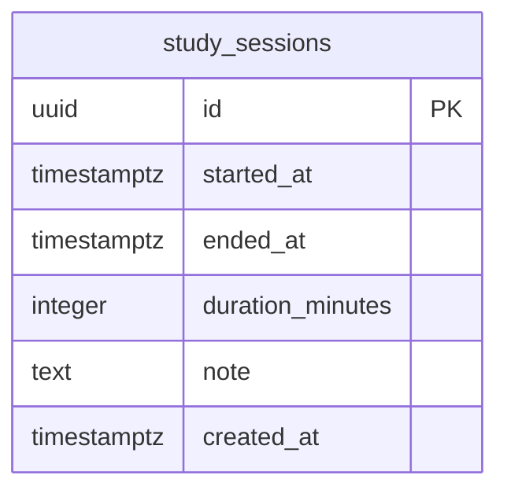

# 🗄️ 간소화 스터디 타이머 - ERD (3시간 구현 버전)

## 문서 정보
- **버전**: v1.0-simplified
- **작성일**: 2026-01-29
- **데이터베이스**: PostgreSQL (Supabase)
- **복잡도**: 최소 (테이블 1개)

---

## 1. ERD 다이어그램

### 1.1 전체 구조 (Mermaid)



### 1.2 구조 설명
- **단일 테이블**: `study_sessions` 하나만 사용
- **인증 없음**: users 테이블 불필요
- **관계 없음**: 외래키, 조인 없음

---

## 2. 테이블 정의

### 2.1 study_sessions (학습 세션)

| 컬럼명 | 데이터 타입 | NULL | 기본값 | 설명 |
|--------|------------|------|--------|------|
| `id` | `uuid` | NOT NULL | `gen_random_uuid()` | 세션 고유 ID (PK) |
| `started_at` | `timestamptz` | NOT NULL | `now()` | 세션 시작 시각 |
| `ended_at` | `timestamptz` | NULL | - | 세션 종료 시각 |
| `duration_minutes` | `integer` | NULL | - | 공부 시간 (분) |
| `timer_check_count` | `integer` | NOT NULL | `0` | 타이머 확인 횟수 (집중도) |
| `session_type` | `varchar(20)` | NOT NULL | `'normal'` | 세션 유형 |
| `note` | `text` | NULL | - | 메모 (선택) |
| `created_at` | `timestamptz` | NOT NULL | `now()` | 레코드 생성 시각 |

**session_type 값:**
- `normal`: 정상 완료 (25분)
- `extended`: 연장됨 (35분+)
- `break_suggested`: 휴식 제안됨

---

## 3. SQL 스키마

### 3.1 테이블 생성

```sql
-- UUID 확장 활성화
CREATE EXTENSION IF NOT EXISTS "uuid-ossp";

-- study_sessions 테이블 생성
CREATE TABLE study_sessions (
  id uuid PRIMARY KEY DEFAULT gen_random_uuid(),
  started_at timestamptz NOT NULL DEFAULT now(),
  ended_at timestamptz,
  duration_minutes integer,
  timer_check_count integer NOT NULL DEFAULT 0,
  session_type varchar(20) NOT NULL DEFAULT 'normal',
  note text,
  created_at timestamptz NOT NULL DEFAULT now()
);

-- 제약조건: 종료 시간은 시작 시간보다 나중이어야 함
ALTER TABLE study_sessions
  ADD CONSTRAINT chk_session_time_order
  CHECK (ended_at IS NULL OR ended_at > started_at);

-- 제약조건: 공부 시간은 0보다 커야 함
ALTER TABLE study_sessions
  ADD CONSTRAINT chk_duration_positive
  CHECK (duration_minutes IS NULL OR duration_minutes > 0);

-- 제약조건: 타이머 확인 횟수는 0 이상
ALTER TABLE study_sessions
  ADD CONSTRAINT chk_timer_check_positive
  CHECK (timer_check_count >= 0);

-- 제약조건: 세션 타입
ALTER TABLE study_sessions
  ADD CONSTRAINT chk_session_type
  CHECK (session_type IN ('normal', 'extended', 'break_suggested'));
```

### 3.2 인덱스

```sql
-- 최근 세션 조회용 (가장 많이 사용)
CREATE INDEX idx_sessions_created_desc
  ON study_sessions(created_at DESC);

-- 날짜별 필터링용
CREATE INDEX idx_sessions_started
  ON study_sessions(started_at);
```

---

## 4. 쿼리 예시

### 4.1 세션 저장
```sql
INSERT INTO study_sessions (
  started_at,
  ended_at,
  duration_minutes,
  timer_check_count,
  session_type,
  note
)
VALUES (
  '2026-01-29 14:00:00+00',
  '2026-01-29 14:25:00+00',
  25,
  2,  -- 타이머 2회 확인 (집중 중)
  'normal',
  '수학 공부'
);
```

### 4.2 최근 50개 세션 조회
```sql
SELECT
  id,
  started_at,
  ended_at,
  duration_minutes,
  note
FROM study_sessions
ORDER BY created_at DESC
LIMIT 50;
```

### 4.3 오늘 총 공부 시간
```sql
SELECT
  COALESCE(SUM(duration_minutes), 0) as total_minutes
FROM study_sessions
WHERE DATE(started_at) = CURRENT_DATE;
```

### 4.4 이번 주 총 공부 시간
```sql
SELECT
  COALESCE(SUM(duration_minutes), 0) as total_minutes
FROM study_sessions
WHERE started_at >= DATE_TRUNC('week', CURRENT_DATE);
```

### 4.5 날짜별 공부 시간 (최근 7일)
```sql
SELECT
  DATE(started_at) as study_date,
  SUM(duration_minutes) as total_minutes,
  COUNT(*) as session_count,
  AVG(timer_check_count) as avg_checks,
  COUNT(CASE WHEN session_type = 'extended' THEN 1 END) as extended_count
FROM study_sessions
WHERE started_at >= CURRENT_DATE - INTERVAL '7 days'
GROUP BY DATE(started_at)
ORDER BY study_date DESC;
```

### 4.6 집중도 분석 (타이머 확인 횟수 기반)
```sql
-- 평균 집중도 (확인 횟수가 적을수록 집중)
SELECT
  CASE
    WHEN timer_check_count <= 2 THEN '매우 집중'
    WHEN timer_check_count <= 4 THEN '집중'
    WHEN timer_check_count <= 6 THEN '보통'
    ELSE '산만'
  END as focus_level,
  COUNT(*) as session_count,
  AVG(duration_minutes) as avg_duration
FROM study_sessions
WHERE ended_at IS NOT NULL
GROUP BY
  CASE
    WHEN timer_check_count <= 2 THEN '매우 집중'
    WHEN timer_check_count <= 4 THEN '집중'
    WHEN timer_check_count <= 6 THEN '보통'
    ELSE '산만'
  END
ORDER BY MIN(timer_check_count);
```

---

## 5. Supabase 설정

### 5.1 RLS (Row Level Security) - 선택사항

**단일 사용자이므로 RLS 불필요**, 하지만 보안을 위해 설정하려면:

```sql
-- RLS 활성화
ALTER TABLE study_sessions ENABLE ROW LEVEL SECURITY;

-- 모든 사용자가 모든 데이터 접근 가능 (인증 없음)
CREATE POLICY "Allow all operations"
  ON study_sessions
  FOR ALL
  TO anon, authenticated
  USING (true)
  WITH CHECK (true);
```

### 5.2 Realtime 비활성화

```sql
-- 실시간 동기화 불필요 (성능 향상)
ALTER PUBLICATION supabase_realtime DROP TABLE study_sessions;
```

---

## 6. 클라이언트 코드 예시

### 6.1 Supabase 클라이언트 설정

```typescript
// lib/supabase.ts
import { createClient } from '@supabase/supabase-js'

const supabaseUrl = process.env.NEXT_PUBLIC_SUPABASE_URL!
const supabaseKey = process.env.NEXT_PUBLIC_SUPABASE_ANON_KEY!

export const supabase = createClient(supabaseUrl, supabaseKey)

export interface StudySession {
  id: string
  started_at: string
  ended_at: string | null
  duration_minutes: number | null
  timer_check_count: number
  session_type: 'normal' | 'extended' | 'break_suggested'
  note: string | null
  created_at: string
}
```

### 6.2 세션 저장 함수

```typescript
// lib/api.ts
import { supabase, StudySession } from './supabase'

export async function saveSession(data: {
  started_at: Date
  ended_at: Date
  duration_minutes: number
  timer_check_count: number
  session_type: 'normal' | 'extended' | 'break_suggested'
  note?: string
}) {
  const { data: session, error } = await supabase
    .from('study_sessions')
    .insert({
      started_at: data.started_at.toISOString(),
      ended_at: data.ended_at.toISOString(),
      duration_minutes: data.duration_minutes,
      timer_check_count: data.timer_check_count,
      session_type: data.session_type,
      note: data.note || null
    })
    .select()
    .single()

  if (error) throw error
  return session as StudySession
}
```

### 6.3 세션 조회 함수

```typescript
export async function getRecentSessions(limit = 50) {
  const { data, error } = await supabase
    .from('study_sessions')
    .select('*')
    .order('created_at', { ascending: false })
    .limit(limit)

  if (error) throw error
  return data as StudySession[]
}

export async function getTodayTotal() {
  const today = new Date().toISOString().split('T')[0]

  const { data, error } = await supabase
    .from('study_sessions')
    .select('duration_minutes')
    .gte('started_at', `${today}T00:00:00`)
    .lte('started_at', `${today}T23:59:59`)

  if (error) throw error

  const total = data.reduce((sum, s) => sum + (s.duration_minutes || 0), 0)
  return total
}

export async function getWeeklyTotal() {
  const today = new Date()
  const weekStart = new Date(today.setDate(today.getDate() - today.getDay()))

  const { data, error } = await supabase
    .from('study_sessions')
    .select('duration_minutes')
    .gte('started_at', weekStart.toISOString())

  if (error) throw error

  const total = data.reduce((sum, s) => sum + (s.duration_minutes || 0), 0)
  return total
}
```

---

## 7. 데이터 예시

### 7.1 샘플 데이터

```sql
INSERT INTO study_sessions (
  started_at, ended_at, duration_minutes,
  timer_check_count, session_type, note
)
VALUES
  ('2026-01-29 09:00:00+00', '2026-01-29 09:25:00+00', 25, 1, 'normal', '수학 - 미적분'),
  ('2026-01-29 10:30:00+00', '2026-01-29 11:05:00+00', 35, 0, 'extended', '영어 단어'),
  ('2026-01-29 14:00:00+00', '2026-01-29 14:20:00+00', 20, 5, 'break_suggested', '코딩 공부'),
  ('2026-01-28 15:00:00+00', '2026-01-28 15:25:00+00', 25, 2, 'normal', '물리 복습'),
  ('2026-01-28 16:00:00+00', '2026-01-28 16:35:00+00', 35, 1, 'extended', NULL);
```

### 7.2 예상 결과

| id | started_at | duration | checks | type | note |
|----|-----------|----------|--------|------|------|
| abc | 2026-01-29 09:00 | 25분 | 1 | normal | 수학 - 미적분 |
| def | 2026-01-29 10:30 | 35분 | 0 | extended | 영어 단어 (연장) |
| ghi | 2026-01-29 14:00 | 20분 | 5 | break_suggested | 코딩 (휴식 제안) |

---

## 8. 성능 고려사항

### 8.1 예상 데이터량

**1년 사용 시**
- 하루 평균 10세션
- 연간 약 3,650개 레코드
- 평균 행 크기: ~200 bytes
- **총 데이터 크기: ~730 KB** (인덱스 포함 ~1.5 MB)

### 8.2 쿼리 성능

| 쿼리 | 예상 성능 | 최적화 |
|------|----------|--------|
| 최근 50개 조회 | < 10ms | `idx_sessions_created_desc` 사용 |
| 오늘 총 시간 | < 20ms | `idx_sessions_started` 사용 |
| 주간 총 시간 | < 30ms | 날짜 필터링 최적화 |

---

## 9. 마이그레이션

### 9.1 Supabase Migration

```bash
# supabase/migrations/20260129000001_create_sessions.sql

-- Enable UUID extension
CREATE EXTENSION IF NOT EXISTS "uuid-ossp";

-- Create study_sessions table
CREATE TABLE study_sessions (
  id uuid PRIMARY KEY DEFAULT gen_random_uuid(),
  started_at timestamptz NOT NULL DEFAULT now(),
  ended_at timestamptz,
  duration_minutes integer,
  note text,
  created_at timestamptz NOT NULL DEFAULT now(),
  CONSTRAINT chk_session_time_order CHECK (ended_at IS NULL OR ended_at > started_at),
  CONSTRAINT chk_duration_positive CHECK (duration_minutes IS NULL OR duration_minutes > 0)
);

-- Create indexes
CREATE INDEX idx_sessions_created_desc ON study_sessions(created_at DESC);
CREATE INDEX idx_sessions_started ON study_sessions(started_at);

-- Enable RLS (optional)
ALTER TABLE study_sessions ENABLE ROW LEVEL SECURITY;

CREATE POLICY "Allow all operations"
  ON study_sessions FOR ALL
  TO anon, authenticated
  USING (true)
  WITH CHECK (true);
```

### 9.2 적용

```bash
# Supabase CLI 사용
supabase migration new create_sessions
supabase db push

# 또는 Supabase Dashboard에서 SQL Editor로 직접 실행
```

---

## 10. 백업 및 복원

### 10.1 데이터 백업

```sql
-- CSV 내보내기 (Supabase Dashboard)
COPY study_sessions TO '/tmp/sessions_backup.csv' CSV HEADER;
```

### 10.2 데이터 복원

```sql
-- CSV 가져오기
COPY study_sessions(started_at, ended_at, duration_minutes, note)
FROM '/tmp/sessions_backup.csv' CSV HEADER;
```

---

## 11. 향후 확장 가능 컬럼

**Phase 2 추가 시 고려**

```sql
ALTER TABLE study_sessions
  ADD COLUMN subject varchar(100),     -- 과목
  ADD COLUMN focus_score decimal(3,1); -- 집중도 (1-10)
```

---

## 12. 비교: 원본 vs 간소화

| 항목 | 원본 ERD | 간소화 ERD |
|------|---------|-----------|
| 테이블 수 | 10개 | 1개 |
| 관계 | 14개 FK | 0개 |
| 인덱스 | 20+ | 2개 |
| RLS 정책 | 15+ | 1개 (선택) |
| 총 컬럼 수 | 80+ | 8개 |
| 복잡도 | 높음 | 최소 |
| 구현 시간 | 4시간+ | 20분 |

---

**문서 버전**: v1.1-simplified-adaptive
**작성일**: 2026-01-29
**최종 수정**: 2026-01-29 (적응형 타이머 컬럼 추가)
**구현 난이도**: ⭐ (초급)
**예상 구현 시간**: 20분
